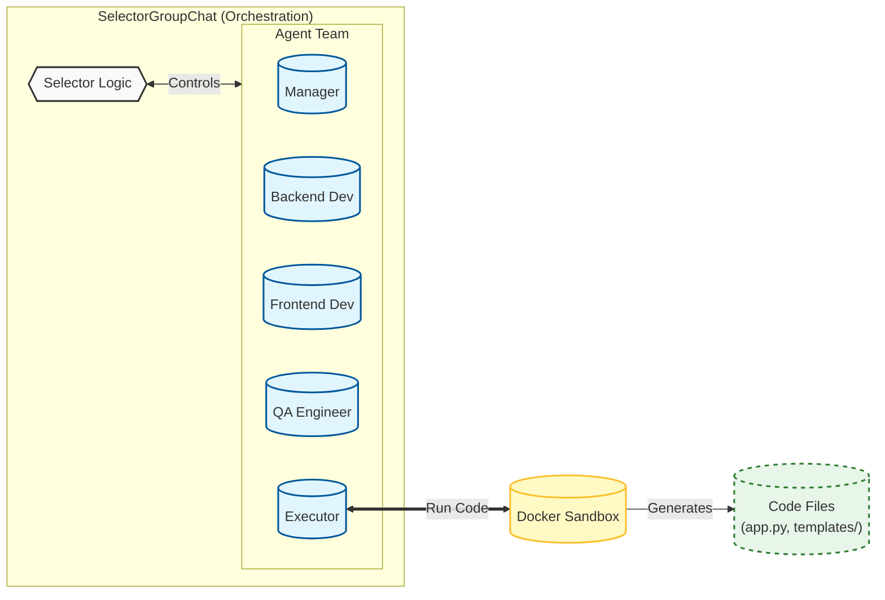

# Autonomous DevOps Agent Squad


An **Event-Driven Multi-Agent System** where a specialized squad of AI agents collaborates to build, test, and fix full-stack web applications without human intervention.

Unlike simple chatbots, this system runs in a **Dockerized Sandbox**, allowing agents to execute real terminal commands, manage git repositories, and recover from errors autonomously.

---

## Architecture

This project utilizes **Microsoft AutoGen (v0.7.5)** in a **Hub-and-Spoke** event-driven architecture. A `SelectorGroupChat` orchestrates the flow between agents based on clear handoff rules (e.g., *Dev -> Executor -> Dev*).




## Key Features

*   **Specialized Agent Personas**:
    *   **Manager**: Breaks down requirements into tasks and delegates.
    *   **Backend Developer**: Implements logical Flask routes and data models.
    *   **Frontend Developer**: Designs premium, responsive UIs (Glassmorphism, Tailwind, etc.).
    *   **QA Engineer**: Writes programmatic tests and verifies UI elements.
    *   **Executor**: A dedicated agent that safely runs code in the sandbox.
*   **Modular Persona System**: Agent prompts are decoupled from code, stored in `prompts/*.txt` for easy iteration.
*   **Secure Sandboxing**: All code executes inside an isolated Docker container. Agents can run destructive commands safely.
*   **Self-Healing Loops**: If a test fails, the QA agent reports it, and the Developer agent iteratively fixes the code until it passes.

-----

## Tech Stack

| Component | Technology | Purpose |
| :--- | :--- | :--- |
| **Orchestration** | AutoGen AgentChat v0.7.5 | Multi-agent coordination & selector logic |
| **Sandbox** | Docker SDK | Isolated execution environment |
| **LLM** | GitHub Models (GPT-4o) | High-level reasoning & code generation |
| **Backend** | Flask (Python) | Generated application framework |

-----

## Getting Started

### Prerequisites

*   **Docker Desktop / Docker Engine** (Must be running)
*   Python 3.10+
*   A **GitHub Personal Access Token** (or Azure OpenAI Key)

### Installation

1.  **Clone the Repository**

    ```bash
    git clone https://github.com/anandn1/agentic-devops-sandbox.git
    cd agentic-devops-sandbox
    ```

2.  **Install Dependencies**

    ```bash
    pip install -r requirements.txt
    ```

3.  **Configure Environment**
    Create a `.env` file in the root directory:

    ```bash
    GITHUB_TOKEN=github_pat_...
    ```

4.  **Run the Agent Squad**

    ```bash
    python main.py
    ```

-----

## Project Structure

```text
agentic-devops-sandbox/
├── .env                  # API Keys (Ignored by Git)
├── main.py               # Entry point: Orchestrates the Team
├── prompts/              
│   ├── manager.txt
│   ├── backend_dev.txt
│   ├── frontend_dev.txt
│   ├── qa_engineer.txt
│   └── task.txt
├── requirements.txt      # Dependencies
├── Dockerfile            # Sandbox Definition
└── full_stack_workspace/ # Generated Web Application
```

-----

## Roadmap

*   [x] **Core Architecture:** Event-Driven AutoGen v0.7.5
*   [x] **Infrastructure:** Docker Container Integration
*   [x] **Capability:** Git & System Administration
*   [x] **Horizontal Scaling:** Implementing a "Manager Agent" to delegate tasks to sub-teams.
*   [ ] **Long-Term Memory:** Integrating Vector DB (Chroma) to allow the agent to reference documentation.
*   [ ] **Human-in-the-Loop:** Adding an approval step before `git push` operations.

-----
