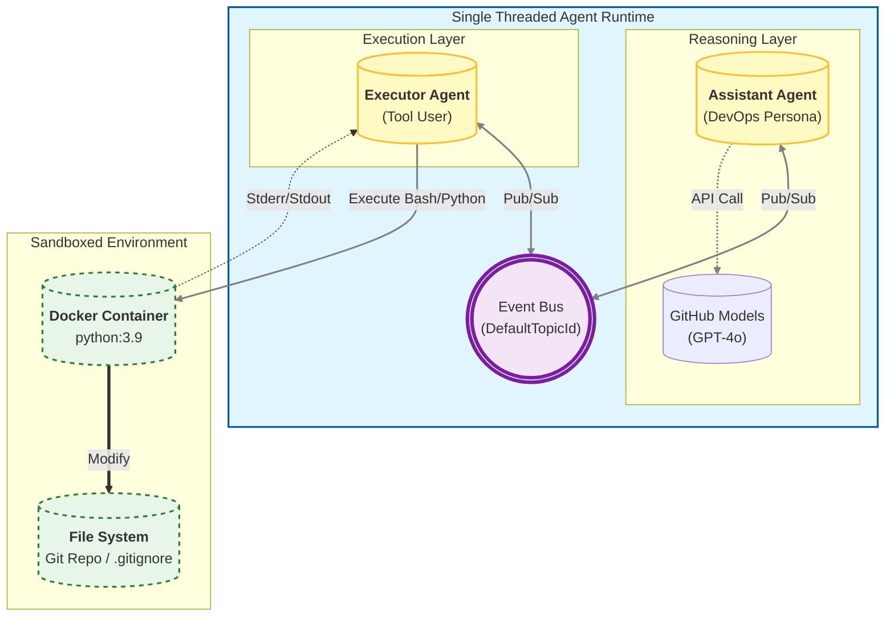

#  Autonomous DevOps Agent & Code Sandbox


An **Event-Driven Autonomous System** capable of executing complex DevOps workflows without human intervention. 

Unlike standard chatbots, this agent operates within a **Dockerized Sandbox**, allowing it to safely install system dependencies (`git`, `curl`), manage file systems, and recover from runtime errors through an iterative self-healing feedback loop.

---

##  Architecture

This project utilizes **Microsoft AutoGen Core (v0.7.5)** to decouple reasoning from execution using a **Publish/Subscribe** pattern.




##  Key Features

  * ** Secure Sandboxing:** All code executes inside an isolated Docker container (`python:3.9`). The agent can execute `rm -rf /` inside the container without harming the host machine.
  * ** Event-Driven Design:** Built on `autogen-core`, utilizing `SingleThreadedAgentRuntime` and a centralized event bus rather than rigid sequential loops.
  * ** Self-Healing Mechanism:** The agent analyzes `stderr` output. If a script fails (e.g., missing `requests` library or Git config error), the agent autonomously formulates a fix and retries.
  * ** Full DevOps Capabilities:** Beyond Python, the agent writes **Bash scripts**, manages **Git Repositories**, and configures system environments (`apt-get`).

-----


-----

##  Tech Stack

| Component | Technology | Purpose |
| :--- | :--- | :--- |
| **Orchestration** | AutoGen Core (v0.7.5) | Event-driven agent runtime & routing |
| **Sandbox** | Docker SDK | Isolated execution environment |
| **LLM** | GitHub Models (GPT-4o) | Reasoning & Code Generation |
| **Language** | Python 3.10+ | Asyncio & Typing |

-----

## 📦 Getting Started

### Prerequisites

  * **Docker Desktop / Docker Engine** (Must be running)
  * Python 3.10+
  * A **GitHub Personal Access Token** 

### Installation

1.  **Clone the Repository**

    ```bash
    git clone [https://github.com/anandn1/self-healing-agent.git](https://github.com/YOUR_USERNAME/self-healing-agent.git)
    cd self-healing-agent
    ```

2.  **Install Dependencies**

    ```bash
    pip install -r requirements.txt
    ```

3.  **Configure Environment**
    Create a `.env` file in the root directory:

    ```bash
    GITHUB_TOKEN=github_pat_...
    ```

4.  **Run the Agent**

    ```bash
    python main.py
    ```

-----

##  Project Structure

```text
self-healing-agent/
├── .env                # API Keys (Ignored by Git)
├── main.py             # Core Event-Driven Agent Logic
├── prompts/            # Agent Persona & Task Prompts
├── requirements.txt    # Dependencies (pyautogen, docker, azure-core)
├── coding_workspace/   # Shared volume where Docker writes files
└── logs/               # Execution logs demonstrating self-healing
```

-----

##  Roadmap

  * [x] **Core Architecture:** Event-Driven AutoGen v0.4
  * [x] **Infrastructure:** Docker Container Integration
  * [x] **Capability:** Git & System Administration
  * [ ] **Horizontal Scaling:** Implementing a "Manager Agent" to delegate tasks to sub-teams.
  * [ ] **Long-Term Memory:** Integrating Vector DB (Chroma) to allow the agent to reference documentation.
  * [ ] **Human-in-the-Loop:** Adding an approval step before `git push` operations.

-----
